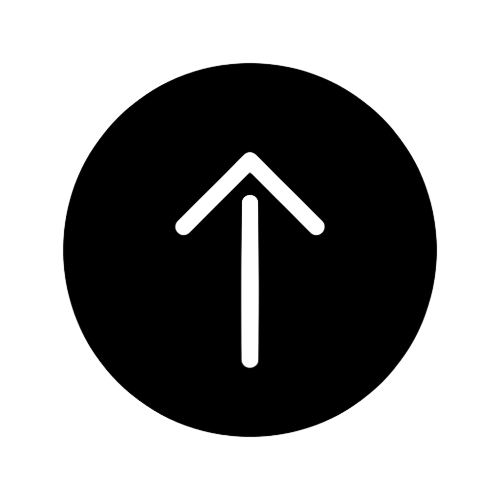

<h1 style="background-color:red;
    color:white;">Tapan Padaliya
</h1>

## Project 1
 

  

  <h3 align="center">MG Ecommerce</h3>

<h4 align="left">Technologies Used : </h4>

[![React][MONGO.org]][MONGO-url]
[![React][EXP.org]][EXP-url]
[![React][React.js]][React-url]
[![React][NODE.org]][NODE-url]

 <h4 align="left">About : This Web Application is Used to manage E commerce Records and Manage Business Commerce Things.</h4>
  <h4 align="left">Document : <a href="https://github.com/TapanPadaliya/MG_Ecommerce_MERN_Web/blob/main/MG%20Presentation.pdf">🔗 View</a></h4>
  <h4 align="left">Repository : <a href="https://github.com/TapanPadaliya/MG_Ecommerce_MERN_Web">🔗 Repository</a></h4>
    
   
    
## Project 2
    

  

  <h3 align="center">E-buy Antiques</h3>

<h4 align="left">Technologies Used : </h4>

[![React][DN.org]][ND-url]
[![React][HTML.org]][HTML-url]
[![React][CSS.org]][CSS-url]
[![React][JS.org]][JS-url]

 <h4 align="left">About : This Web Application is Used to manage E commerce Records and Manage Business Commerce Things.</h4>
  <h4 align="left">Document : <a href="https://github.com/TapanPadaliya/MG_Ecommerce_MERN_Web/blob/main/MG%20Presentation.pdf">🔗 View</a></h4>
  <h4 align="left">Repository : <a href="https://github.com/TapanPadaliya/E-Buy_Antiques_ASP.netWeb">🔗 Repository</a></h4>
 

## Project 3
    

  

  <h3 align="center">Smart Sankul</h3>

<h4 align="left">Technologies Used : </h4>

[![React][DJ.org]][DJ-url]
[![React][Python.org]][Python-url]
[![React][HTML.org]][HTML-url]
[![React][CSS.org]][CSS-url]
[![React][JS.org]][JS-url]

 <h4 align="left">About : This Web Application is Used to manage Educational Records and Manage Things.</h4>
  <h4 align="left">Document : <a href="https://github.com/TapanPadaliya/Smart_Sankul_DjangoWeb/blob/master/Presentation.pdf">🔗 View</a></h4>
  <h4 align="left">Repository : <a href="https://github.com/TapanPadaliya/Smart_Sankul_DjangoWeb">🔗 Repository</a></h4>
  
  
  

<!--
* [![Next][Next.js]][Next-url]
* [![React][React.js]][React-url]
* [![Vue][Vue.js]][Vue-url]
* [![Angular][Angular.io]][Angular-url]
* [![Svelte][Svelte.dev]][Svelte-url]
* [![Laravel][Laravel.com]][Laravel-url]
* [![Bootstrap][Bootstrap.com]][Bootstrap-url]
* [![JQuery][JQuery.com]][JQuery-url]
-->

-.NET%206.0-blueviolet
[Python.shield]: https://img.shields.io/badge/Python-20232A?style=for-the-badge&logo=python&logoColor=yellow
[Python-url]: https://www.python.org/
[Python.org]: https://img.shields.io/badge/Python-20232A?style=for-the-badge&logo=python&logoColor=yellow

[DN.shield]: https://img.shields.io/badge/ASP.Net-20232A?style=for-the-badge&logo=css&logoColor=Blue
[DN-url]: https://dotnet.microsoft.com/en-us/apps/aspnet
[DN.org]: https://img.shields.io/badge/ASP.Net-20232A?style=for-the-badge&logo=css&logoColor=Blue

[MONGO.shield]: https://img.shields.io/badge/-MongoDB-20232A?style=for-the-badge&logo=MongoDB&logoColor=green
[MONGO-url]: https://www.mongodb.com/
[MONGO.org]: https://img.shields.io/badge/-MongoDB-20232A?style=for-the-badge&logo=MongoDB&logoColor=green

[NODE.shield]: https://img.shields.io/badge/-Node.js-20232A?style=for-the-badge&logo=node.js&logoColor=green
[NODE-url]: https://nodejs.org/en/
[NODE.org]: https://img.shields.io/badge/-Node.js-20232A?style=for-the-badge&logo=node.js&logoColor=green

[EXP.shield]: https://img.shields.io/badge/Express-20232A?style=for-the-badge&logo=E&logoColor=black
[EXP-url]: https://expressjs.com/
[EXP.org]: https://img.shields.io/badge/Express-20232A?style=for-the-badge&logo==E&logoColor=black

[HTML.shield]: https://img.shields.io/badge/HTML-20232A?style=for-the-badge&logo=HTML5
[HTML-url]: https://www.html.org/
[HTML.org]: https://img.shields.io/badge/HTML-20232A?style=for-the-badge&logo=HTML5

[CSS.shield]: https://img.shields.io/badge/css-20232A?style=for-the-badge&logo=css&logoColor=#264de4
[CSS-url]: https://www.css.org/
[CSS.org]: https://img.shields.io/badge/css-20232A?style=for-the-badge&logo=css&logoColor=#264de4

[JS.shield]: https://img.shields.io/badge/JavaScript-20232A?style=for-the-badge&logo=JavaScript&logoColor=yellow
[JS-url]: https://javascript.info/
[JS.org]: https://img.shields.io/badge/JavaScript-20232A?style=for-the-badge&logo=JavaScript&logoColor=yellow  

[DJ.shield]: https://img.shields.io/badge/Django-20232A?style=for-the-badge&logo=django&logoColor=blue
[DJ-url]: https://www.djangoproject.com/
[DJ.org]: https://img.shields.io/badge/Django-20232A?style=for-the-badge&logo=django&logoColor=blue

[Python-url]: https://github.com/othneildrew/Best-README-Template/graphs/contributors
[contributors-shield]: https://img.shields.io/github/contributors/othneildrew/Best-README-Template.svg?style=for-the-badge
[contributors-url]: https://github.com/othneildrew/Best-README-Template/graphs/contributors
[forks-shield]: https://img.shields.io/github/forks/othneildrew/Best-README-Template.svg?style=for-the-badge
[forks-url]: https://github.com/othneildrew/Best-README-Template/network/members
[stars-shield]: https://img.shields.io/github/stars/othneildrew/Best-README-Template.svg?style=for-the-badge
[stars-url]: https://github.com/othneildrew/Best-README-Template/stargazers
[issues-shield]: https://img.shields.io/github/issues/othneildrew/Best-README-Template.svg?style=for-the-badge
[issues-url]: https://github.com/othneildrew/Best-README-Template/issues
[license-shield]: https://img.shields.io/github/license/othneildrew/Best-README-Template.svg?style=for-the-badge
[license-url]: https://github.com/othneildrew/Best-README-Template/blob/master/LICENSE.txt
[linkedin-shield]: https://img.shields.io/badge/-LinkedIn-black.svg?style=for-the-badge&logo=linkedin&colorB=555
[linkedin-url]: https://linkedin.com/in/othneildrew
[product-screenshot]: images/screenshot.png
[Next.js]: https://img.shields.io/badge/next.js-000000?style=for-the-badge&logo=nextdotjs&logoColor=white
[Next-url]: https://nextjs.org/
[React.js]: https://img.shields.io/badge/React-20232A?style=for-the-badge&logo=react&logoColor=61DAFB
[React-url]: https://reactjs.org/

[Vue.js]: https://img.shields.io/badge/Vue.js-35495E?style=for-the-badge&logo=vuedotjs&logoColor=4FC08D
[Vue-url]: https://vuejs.org/
[Angular.io]: https://img.shields.io/badge/Angular-DD0031?style=for-the-badge&logo=angular&logoColor=white
[Angular-url]: https://angular.io/
[Svelte.dev]: https://img.shields.io/badge/Svelte-4A4A55?style=for-the-badge&logo=svelte&logoColor=FF3E00
[Svelte-url]: https://svelte.dev/
[Laravel.com]: https://img.shields.io/badge/Laravel-FF2D20?style=for-the-badge&logo=laravel&logoColor=white
[Laravel-url]: https://laravel.com
[Bootstrap.com]: https://img.shields.io/badge/Bootstrap-563D7C?style=for-the-badge&logo=bootstrap&logoColor=white
[Bootstrap-url]: https://getbootstrap.com
[JQuery.com]: https://img.shields.io/badge/jQuery-0769AD?style=for-the-badge&logo=jquery&logoColor=white
[JQuery-url]: https://jquery.com 

